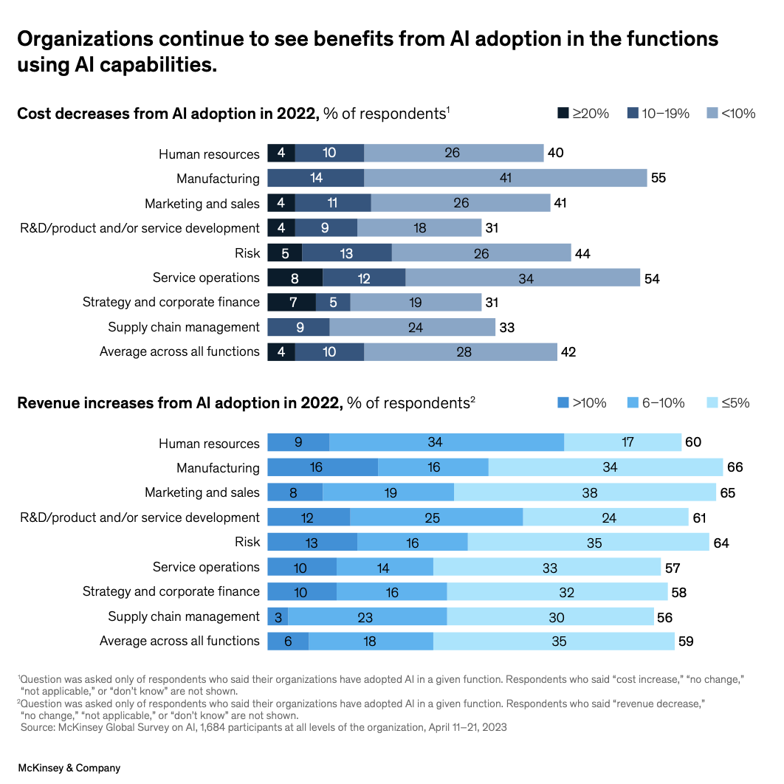

This document traces two claims in the Lancet HIV Comment to AI-generated sources. While the first claim's chain of evidence appears more open to interpretation, the second claim seems to lift verbatim text from a sponsor's white paper, **which itself appears to include fabricated citations.**

---

## Claim 1

### 1. Lancet Comment
The claim in the Lancet Comment is:
> In Kenya and Nigeria, AI powers telemedicine-based PrEP services that eliminate the need for frequent clinic visits.

### 2. Audere White Paper
The Audere white paper includes the following sentences which are relevant to the claim:

> In low- and middle-income countries (LMICs), AI and telemedicine are transforming how HIV prevention—particularly PrEP—is delivered to those who need it most.

> Telemedicine has also opened new doors for PrEP access by eliminating the need for frequent in-person visits. In countries like Nigeria and Kenya, clients can start and manage PrEP through video consultations, app-based self-screening, and pharmacy pick-up options.

The Audere white paper does not cite any references for these claims, so we cannot evaluate the chain of evidence beyond the Audere white paper with any confidence.

However, the passage that contains both of these claims was flagged as likely AI-written (probability 100%) by GPTzero, a popular tool for identifying AI-generated prose. You can run the same test on the passage [here](https://app.gptzero.me/documents/90b7593e-7f65-4db7-9883-49f4ba3d059a/share). The author of the white paper is the same as the author of the Lancet Comment, so it seems reasonable to assume AI may have also been used during the writing of the Comment, even if the final wording was not outright AI generated. This could be a case where the author used AI to gather information and then wrote the Comment by hand, but included errors propagated by the AI.

Additionally, several references in the white paper appear misaligned with the associated claims, and a few may even contradict them outright. Given the white paper is not peer-reviewed, we do not evaluate the merit of the claims versus the references in this repo, but we do view these erroneous references as evidence that the author of the white paper and Comment does not always carefully review the references they cite in published work.

In an initial web search we were unable to locate independent evidence of AI-powered telemedicine-based PrEP services in Nigeria. While the absence of evidence is not conclusive, it raises the possibility that an AI-related misinterpretation may have introduced the claim.

---

## Claim 2

### 1. Lancet Comment
The claim in the Lancet Comment is:
> Predictive models could further enhance these programmes by helping providers identify individuals at greatest risk of HIV acquisition, forecast supply needs, and target outreach efforts more effectively.

> At the systems level, AI could enable efficient resource planning and better decision making. Programme managers can analyse large-scale datasets to forecast medication stock, generate culturally tailored advice, identify geographical hotspots, improve outreach approaches, and refine training and resource allocation.

The Lancet Comment does not cite the Audere white paper for this statement, instead referencing Balzer et al.'s [*Machine learning to identify persons at high-risk of human immunodeficiency virus acquisition in rural Kenya and Uganda*](../source_materials/ciz1096.pdf), which, on our reading, does not appear to support the claim.

### 2. Audere White Paper
[Artificial intelligence to enhance HIV prevention in age of disruptions](https://static1.squarespace.com/static/64ff6a6dd00b77132a60f99b/t/681ccce37331774ae0b52d42/1746717923752/Leveraging+AI+to+enhance+HIV+prevention.pdf)

The Audere white paper includes the following sentences which are relevant to the claim:

> AI is further used to forecast medication demand, reducing stockouts and ensuring a stable supply of PrEP at decentralized locations.

> On a systems level, AI can contribute to data-informed decision-making through rapid analysis of large-scale datasets, including better forecasting of supply needs, optimizing outreach, and identifying geographic hotspots for intervention. 

It appears much of the Lancet Comment's claim is lifted from the Audere white paper, with minor changes:
- "On a systems level" is changed to "At the systems level"
- "AI can contribute to data-informed decision-making" is changed to "AI could enable efficient resource planning and better decision making"
- "analysis of large-scale datasets" is changed to "analyse large-scale datasets"
- "forecasting of supply needs" is changed to "forecast medication stock"
- "optimizing outreach" is changed to "improve outreach approaches"
- "identifying geographic hotspots for intervention" is changed to "identify geographical hotspots"

More concerning, the Audere white paper appears to combine two separate McKinsey white papers into a single citation. The citation reads:
> McKinsey Global Institute. The Future of AI in Healthcare. McKinsey & Company; 2023. Available from: https://www.mckinsey.com/capabilities/quantumblack/our-insights/the-state-of-ai-in-2023-generative-ais-breakout-year

The citation's title is "The Future of AI in Healthcare," yet the hyperlink leads to "The state of AI in 2023: Generative AI's breakout year." This mismatch is consistent with patterns often seen in AI-generated citations. To date, we have not located an authentic McKinsey Global Institute report titled "The Future of AI in Healthcare." However, we did find both a LinkedIn post and a blog article that reproduce the same hybrid citation; both appear to be AI-generated.

- LinkedIn post: https://www.linkedin.com/pulse/future-ai-healthcare-trends-predictions-piyush-david-1ikjc/
- GPTzero analysis showing 100% AI-generated: [GPTZero AI Scan](../docs/GPTZero_scans/GPTZero%20AI%20Scan%20-%20%20Piyush%20D.pdf)

- Blog post: https://www.numberanalytics.com/blog/ai-revolution-healthcare-pharma-next5years
- GPTzero analysis showing 100% AI-generated: [GPTZero AI Scan](../docs/GPTZero_scans/GPTZero%20AI%20Scan%20-%20Sarah%20Lee.pdf)
- Note that the author of the blog post disclosed that the post was generated by AI (AI generated claude-3.7 )

While a coincidence is possible, the alignment across sources seems improbable.

A plausible explanation is that the author—like the creators of the LinkedIn and blog posts—may have unknowingly relied on an AI-generated citation.

Let's consider that the Audere white paper may have made an error in either the title of the citation or the URL. Given the URL is more specific, we will evaluate the McKinsey State of AI in 2023 report and continue to trace the claim from there.

### 3. McKinsey State of AI in 2023
The state of AI in 2023: Generative AI’s breakout year https://mck.co/3YdJbED

The McKinsey white paper provides two graphs showing AI-driven cost decreases and revenue increases across business functions. Contrary to the Audere claim, supply chain management scores worst in both categories. 

Thus, not only is the Comment's claim unsupported by the Audere white paper, it is also contradicted by the McKinsey white paper cited by the Audere white paper.

The McKinsey white paper also does not include any evidence for the claim that AI could enable optimized outreach or identify geographical hotspots for intervention, as the Audere white paper claims.

We assess the Lancet Comment's claim to be the direct result of AI hallucination with no factual basis.

*These links trace our reasoning but should not be seen as definitive proof. If you locate stronger evidence or spot mistakes in this chain, we would value a correction or alternative interpretation.*
